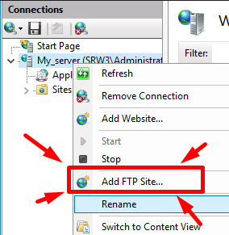

# SRW3

Vieira Diogo
SI-T1a

# Hardware used 
1. Hardware:
    CPU: 2 processors, 1 cores
    Memory: 4.0 GB
    Hard Disk: 60 GB
2. Identifiant:
    administrator
    Pa$$w0rd

# TP01: Installation and configuration of IIS server

## requirement
- Installation Windows Server 2016 x64 - version 1607 (en)
- user with admin privilege 
## HTML page
- in `C:` create a directory with the name "iis_www"
 add in the dir `iis.html`.

 content of iis.html:
 ```html
    <!DOCTYPE html>
    <html lang="en">
        <head>
            <meta charset="UTF-8">
            <meta name="viewport" content="width=device-width, initial-scale=1.0">
            <meta http-equiv="X-UA-Compatible" content="ie=edge">
            <title>MON Site IIS</title>
        </head>
        <body>
            IIS_WEB réussi
        </body>
    </html>
 ```

## Installation IIS
- add ISS roles \


click next and add feature.

- add asp.net service role and click next \


- disable the current web site:
 1. go to iis manager
 2. open the Sites folder
 3. stop each site \


- add a new site:
 1. Right click on the Sites folder
 2. click add new site \


[Add new default file for IIS server](#add-new-default-file-for-iis-server) with the name `iis.html`

## Add new default file for IIS server
1. click on your server
  1.1. In IIS group double click on "Default Document" \
  \
  1.2. Right click, add and write the default file do you want


## Installation PHP
- Install [Visual C++ Redistributable for Visual Studio 2012 Update 4](https://www.microsoft.com/en-us/download/details.aspx?id=30679)
- Download [php 7.4.2](https://windows.php.net/downloads/releases/php-7.4.2-Win32-vc15-x64.zip) 
  - create a `php` directory in `C:` and extract php7.4 in it

- Open IIS Manager
- Click on your server \

- Open Handler Mapping \


Add php module:


 [Add new default file for IIS server](#add-new-default-file-for-iis-server) with the name `index.php`.

 create a `index.php` with `<?php phpinfo(); ?>` in iis_www and **delete** or **rename** `iis.html`.
 
 try to access your web site and you can see php information.

## Install AD
`It's recommended to put a static ip before installation`

add AD domain services, on the last page tick restart checkbox \


after installation, promote your server \
 \
Choose a domain name \
 \
 \
click next until to install button.

restart computer

## Authentification
add authentification role \


Open IIS Manager, click in your server and in IIS group click on `authentification`
and change next status: \ 

## Generate ssl certificate
in IIS Manager, on IIS group, open Server Cerficates.
1. Click `Create Self Signed Certificate` on the right menu 
2. Write `SRW3` and valid your certificate
3. right click on your ssl and export this
4. choose desktop and insert `ssl` in the textbox
5. write an password, example: Pa$$w0rd

## ADD FTP
Add all roles FTP, it's hidden in WEB SERVER (IIS) role.

ADD FTP site: \


FTP site name: ftp
Physical path: C:\iis_www

on the next page, choose your SSL certificate.
on the last page \


Now, if you want to connect at your FTP we have to install `ssl.pfx` based in your desktop.

exemple to configuration with winSCP: \


## Windows Backup
`you have to have another hard drive`

1. add roles and feature, select Windows Server Backup of Features section
2. install
3. open windows server backup
4. Backup Schedule 
5. Select Backup Configuration: Custom
6. Add items: 
    * `C:\iis_www`
    * `C:\windows\system32\inetserv\config`
7. Click on Advanced Settings button and check `VSS full Backup` on VSS Settings tab
8. Specify Backup Time: once a day (choose a time when there is no one working)
9. specify destination type : Back up to a hard disk that is dedicated for backups
10. add your backup hard drive
11. finish

## Sources

- [windows backup](https://www.windows8facile.fr/ws2016-installer-sauvegarde/)
- [create ssl](https://community.sophos.com/kb/en-us/132438)
- [add php](https://www.supinfo.com/articles/single/624-installer-php-serveur-iis)
- [backup IIS with cmd](https://success.trendmicro.com/solution/0124952-backing-up-and-restoring-websites-on-the-internet-information-services-iis-manager#collapseTwo)

<div style="page-break-after: always;"></div>

# TP02 : Configuration of IIS

## Exo 01

1. Creation of directories and html pages.
2. Open posershell and execute next commands:
```powershell
mkdir C:/SRW/Site01 
'<!DOCTYPE html>
    <html lang="en">
        <head>
            <meta charset="UTF-8">
            <meta name="viewport" content="width=device-width, initial-scale=1.0">
            <meta http-equiv="X-UA-Compatible" content="ie=edge">
            <title>MON Site IIS 01</title>
        </head>
        <body>
            MON Site IIS 01
        </body>
    </html>' > C:/SRW/Site01/indexsite01.html 
mkdir C:/SRW/repvirtuel 
'<!DOCTYPE html>
    <html lang="en">
        <head>
            <meta charset="UTF-8">
            <meta name="viewport" content="width=device-width, initial-scale=1.0">
            <meta http-equiv="X-UA-Compatible" content="ie=edge">
            <title>Rep Virtuel</title>
        </head>
        <body>
            Rep Virtuel
        </body>
    </html>' > C:/SRW/repvirtuel/indexvirtuel.html
#open port 8080 with name 8080
netsh advfirewall firewall add rule name="8080" dir=in action=allow protocol=TCP localport=8080
```

Open IIS and add a new site with the name `Site01 du module SRW`.
Change ID to 31 in advanced Settings.


[Add new default file for your site](#add-new-default-file-for-iis-server) with the name `indexsite01.html`

click on the `View Virtual Directories` on the right menu and click `Add Virtual Directory...`

Enable the Directory Browsing, in your site.


Add your virtual repo.


## Exo 02

Open powershell and run the next script to create C:/SRW/Site02 dir and indexsite02.html file.

the script also opens port 8080

```powershell
# copy and past in powershell
mkdir C:/SRW/Site02 
'<!DOCTYPE html>
    <html lang="en">
        <head>
            <meta charset="UTF-8">
            <meta name="viewport" content="width=device-width, initial-scale=1.0">
            <meta http-equiv="X-UA-Compatible" content="ie=edge">
            <title>Site02</title>
        </head>
        <body>
            Mon Site02
        </body>
    </html>' > C:/SRW/Site02/indexsite02.html 
```

Add your new site, always with powershell :
```Powershell
C:\windows\system32\inetsrv\appcmd add site /name:"Site02 du Module SRW" /bindings:"http/*:8888:" /id:32 /physicalPath:"C:\SRW\Site02"

C:\windows\system32\inetsrv\appcmd set config "Site02 du Module SRW" /section:defaultDocument /enabled:true /~files "/+files.[value='indexsite02.html']"

# ADD VIRTUAL REPO
C:\windows\system32\inetsrv\appcmd add vdir /app.name:"Site02 du Module SRW/" /path:/test2 /physicalPath:"C:\SRW\repvirtuel"

# ENABLE directory Browsing 
C:\windows\system32\inetsrv\appcmd set config http://localhost:8888/test2/ /section:directoryBrowse /enabled:true

#open port 8888 with name 8888
netsh advfirewall firewall add rule name="8888" dir=in action=allow protocol=TCP localport=8888

C:\windows\system32\inetsrv\appcmd start site "Site02 du Module SRW"
```

## Exo 03

Open powershell and copy and paste the next script:

```powershell
# copy and past in powershell
mkdir C:/SRW/Site03 
'<!DOCTYPE html>
    <html lang="en">
        <head>
            <meta charset="UTF-8">
            <meta name="viewport" content="width=device-width, initial-scale=1.0">
            <meta http-equiv="X-UA-Compatible" content="ie=edge">
            <title>Site03</title>
        </head>
        <body>
            Mon Site03
        </body>
    </html>' > C:/SRW/Site03/indexsite03.html 
#open port 8080 with name 8080
netsh advfirewall firewall add rule name="8880" dir=in action=allow protocol=TCP localport=8880
```
Add your new site, always with powershell:
```Powershell
C:\windows\system32\inetsrv\appcmd add site /name:"Site03 du Module SRW" /bindings:"http/*:8880:" /id:33 /physicalPath:"C:\SRW\Site03"

C:\windows\system32\inetsrv\appcmd set config "Site03 du Module SRW" /section:defaultDocument /enabled:true /~files "/+files.[value='indexsite03.html']"

#open port 8080 with name 8880
netsh advfirewall firewall add rule name="8880" dir=in action=allow protocol=TCP localport=8880

C:\windows\system32\inetsrv\appcmd start site "Site03 du Module SRW"
```

Now, to add a virtual repository manually in configuration file open `C:\Windows\System32\inetsrv\config\applicationHost.config`.

Search 
```xml
<site name="Site03 du Module SRW" id="33">
    <application path="/">
        <virtualDirectory path="/" physicalPath="C:\SRW\Site03" />
```

Add the next line in `<application>` tag
```xml
    <virtualDirectory path="/test3" physicalPath="C:\SRW\repvirtuel" />
```
save and exit the file.

Open `C:\SRW\Site03\web.config` and add before
```xml
    </system.webServer>
</configuration>
```
the next line:
```xml
<directoryBrowse enabled="true" />
```

## Exo 04 - command lines

1. show all sites on our site:
- `C:\Windows\System32\inetsrv\APPCMD list sites`

2. Show the site on port 8080
- `C:\windows\system32\inetsrv\appcmd list sites http://localhost:8080`

3. Stop the site with port 8080
- `C:\windows\system32\inetsrv\appcmd stop site http://localhost:8080`

4. Delete test1 of site01
- `C:\windows\system32\inetsrv\appcmd delete vdir "Site01 du Module SRW/test1"`

5. Create a backup with appcmd
- `C:\windows\system32\inetsrv\appcmd add backup "srw3"`
6. the location of your backup is `C:\windows\system32\inetsrv\backup`

7. Delete site02
- `C:\windows\system32\inetsrv\appcmd delete site "Site02 du Module SRW"`

8. Restore backup
- `C:\windows\system32\inetsrv\appcmd restore backup "srw3"`

### sources
- [iis command line](https://docs.microsoft.com/en-us/iis/get-started/getting-started-with-iis/getting-started-with-appcmdexe)

<div style="page-break-after: always;"></div>

# TP03 : Sécurité du serveur Web

## Configure a new site

Open **powershell** and copy and paste the next script:

```powershell
# copy and past in powershell
mkdir C:/SRW/labo,C:/SRW/labo/private,C:/SRW/labo/public
'<!DOCTYPE html>
    <html lang="en">
        <head>
            <meta charset="UTF-8">
            <meta name="viewport" content="width=device-width, initial-scale=1.0">
            <meta http-equiv="X-UA-Compatible" content="ie=edge">
            <title>labo</title>
        </head>
        <body>
            Mon labo
        </body>
    </html>' > C:/SRW/labo/labo.html 
'<!DOCTYPE html>
    <html lang="en">
        <head>
            <meta charset="UTF-8">
            <meta name="viewport" content="width=device-width, initial-scale=1.0">
            <meta http-equiv="X-UA-Compatible" content="ie=edge">
            <title>private</title>
        </head>
        <body>
            Mon private
        </body>
    </html>' > C:/SRW/labo/private/private.html
'<!DOCTYPE html>
    <html lang="en">
        <head>
            <meta charset="UTF-8">
            <meta name="viewport" content="width=device-width, initial-scale=1.0">
            <meta http-equiv="X-UA-Compatible" content="ie=edge">
            <title>public</title>
        </head>
        <body>
            Mon public
        </body>
    </html>' > C:/SRW/labo/public/public.html 
```

create your new site, always with powershell:
```Powershell
C:\windows\system32\inetsrv\appcmd add site /name:"labo du Module SRW" /bindings:"http/*:80:" /id:41 /physicalPath:"C:\SRW\labo"

C:\windows\system32\inetsrv\appcmd set config "labo du Module SRW" /section:defaultDocument /enabled:true /~files "/+files.[value='labo.html']"

C:\windows\system32\inetsrv\appcmd set config "labo du Module SRW/private" /section:defaultDocument /enabled:true /~files "/+files.[value='private.html']"

C:\windows\system32\inetsrv\appcmd set config "labo du Module SRW/public" /section:defaultDocument /enabled:true /~files "/+files.[value='public.html']"

#open port 80 with name 80
netsh advfirewall firewall add rule name="80" dir=in action=allow protocol=TCP localport=8880
# close sites on port 80 and open our new site
C:\windows\system32\inetsrv\appcmd stop site http://localhost:80
C:\windows\system32\inetsrv\appcmd start site "labo du Module SRW"
```

## Directory Browsing


By each element of "labo du Module SRW" (like in the image), click on  and click on the righ on enable link.


## Enable public to all users

In IIS Manager, open `labo du Module SRW`, click on the public directory and open authentification of IIS section of right part of windows.

Enable `Anonymous Athentification`.

## Test

1. Open powershell and write the next command line : `C:\windows\system32\inetsrv\appcmd list sites`
2. Open IIS Manager and we can see "labo du Module SRW"
    - on click, we can see private and public dir
3. On web browser, go to http://localhost, a labo page is visible
4. On web browser, go to http://localhost/public, a private page is visible
    * no password require
5. On web browser, go to http://localhost/private, a public page is visible
    * password required
6. rename labo.html of C:\SRW\labo by labos.html, rename private.html of C:\SRW\labo\private by privates.html  and public.html of C:\SRW\labo\public by publics.html
    - re-test step 3, 4 and 5, we can browse in directories

## Configuration ip rules

> all configuration on site is in `labo du Module SRW`

Intall the next Roles : `IP and Domain Restrictions` .


Open `IP Address and Domain Restrictions` in ISS section.
Right click and choose `add deny entry...` and insert the ip to deny.

Now try to access on your site, be careful to empty your cache!

## Authentification Configuration 

### Create a new user

1. Open Active Directory Users and Computers.
2. In SRW3.Example, right click on Users folder.
    * click on New section
    * click on User

User Name and User logon name : SRW_labo
Password : Qwertz123456

uncheck : `User must change password at next logon`
check : `Password never expires`

### Use default account to anonymous authentication

1. Open IIS Manager, open your site and click on Authentification on IIS section.
2. Enable Anonymous Authentication
3. Click on edit and set SRW_labo as default account


#### TEST

1. Try to use an inexisting account for anonymous authentication
    * an error message appeared to inform to use an existing account
2. Open `http://localhost/`
    * Password not required
3. Open `http://localhost/private`
    * Password not required
4. Open `http://localhost/public`
    * Password not required

Create a new user `SRW_private` is password `Qwertz123456`.

### Use digest on private site

Install a new server roles.
on the `Web Server`, `Security` and tick `Digest Authentication`

In private dir of IIS Manager, Open authentication, enable Digest Authentication and disable Anonymous Authentication.

If Digest Authentication isn't visible, close and reopen IIS. Digest is now available.

#### Test 

1. open `http://localhost/private`
    * Use `SRW_private`'s account, it's work
    * Use `SRW_labo`'s account, it's work
    * Cancel first pop-up, a new pop-up ask windows authentication
        * use `administrator`'s account, it's work
  
<div style="page-break-after: always;"></div>

# TP 04 Create an intranet and internet services

Requirement : 
    2 Network Cards
        - 1 Bridge
        - 1 Nat
    Define statics IP:
        - Bridge: 10.229.34.74
        - Intranet: 192.168.178.135

## Create groups and users

1. [Install IIS Serveur](#TP01-Installation-and-configuration-of-IIS-server) the windows serveur backup isn't required

2. Create users and groups

    > users to add

    | LastName | FirstName | Group     | Login   | Password     |
    |---------:|----------:|----------:|--------:|-------------:|
    | DUPONT   | Marcel    | Directeur | mdupont | Qwertz123456 |
    | BRICOT   | Juda      | Ingénieur | jbricot | Asdfgh123456 |
    | ASSAIN   | Marc      | Comptable | massain | Yxcvbn123456 |
    | DEUF     | John      | Ingénieur | jdeuf   | Qaywsx123456 |
    | DIOCY    | Kelly     | Ingénieur | kdiocy  | Edcrfv123456 |
    | Clients  |           |           | dclient | Tgbzhn123456 |

    Open Powershell with administrator privileges and paste the next lines to create users and groups 😉

    ```Powershell    
        Import-Module ActiveDirectory

        $users = @(
        @{lastname = "DUPONT"; firstname = "Marcel"; group = "Directeur"; login = "mdupont"; password = "Qwertz123456"},
        @{lastname = "BRICOT"; firstname = "Juda"; group = "Ingénieur"; login = "jbricot"; password = "Asdfgh123456"},
        @{lastname = "ASSAIN"; firstname = "Marc"; group = "Comptable"; login = "massain"; password = "Yxcvbn123456"},
        @{lastname = "DEUF"; firstname = "John"; group = "Ingénieur"; login = "jdeuf"; password = "Qaywsx123456"},
        @{lastname = "DIOCY"; firstname = "Kelly"; group = "Ingénieur"; login = "kdiocy"; password = "Edcrfv123456"},
        @{lastname = "Clients"; firstname = ""; group = ""; login = "dclient"; password = "Tgbzhn123456"}
        )


        foreach($user in $users)
        {
            $login = $user.login
            $lastname = $user.lastname
            $firstname = $user.firstname
            $password = $user.password
            $group = $user.group

            New-ADUser `
            -SamAccountName $login `
            -UserPrincipalName "$login@srw3.example" `
            -Name "$firstname $lastname" `
            -GivenName $firstname `
            -Surname $lastname `
            -Enabled $True `
            -ChangePasswordAtLogon $False `
            -DisplayName "$firstname $lastname" `
            -AccountPassword (convertto-securestring $password -AsPlainText -Force)
            if([string]::IsNullOrEmpty($group))
            {
                $GroupExists = Get-ADGroup -Filter {Name -eq $group}
                if([string]::IsNullOrEmpty($GroupExists))
                {
                    New-ADGroup -Name $group –groupscope Global
                }
                Add-ADGroupMember -Identity $group -Members $login 
            }
        }
    ```

## Create Sites

Open powershell with administrator privileges and past the next command:
```powershell
# copy and past in powershell
mkdir C:/SRW/internet,C:/SRW/intranet,C:/SRW/intranet/dclient
'<!DOCTYPE html>
    <html lang="en">
        <head>
            <meta charset="UTF-8">
            <meta name="viewport" content="width=device-width, initial-scale=1.0">
            <meta http-equiv="X-UA-Compatible" content="ie=edge">
            <title>internet</title>
        </head>
        <body>
            Mon internet
        </body>
    </html>' > C:/SRW/internet/index.html 
'<!DOCTYPE html>
    <html lang="en">
        <head>
            <meta charset="UTF-8">
            <meta name="viewport" content="width=device-width, initial-scale=1.0">
            <meta http-equiv="X-UA-Compatible" content="ie=edge">
            <title>intranet</title>
        </head>
        <body>
            Mon intranet
        </body>
    </html>' > C:/SRW/intranet/index.html
'<!DOCTYPE html>
    <html lang="en">
        <head>
            <meta charset="UTF-8">
            <meta name="viewport" content="width=device-width, initial-scale=1.0">
            <meta http-equiv="X-UA-Compatible" content="ie=edge">
            <title>dclient</title>
        </head>
        <body>
            Mon dclient
        </body>
    </html>' > C:/SRW/intranet/dclient/index.html

C:\windows\system32\inetsrv\appcmd add site /name:"Internet" /bindings:"http/10.229.34.74:80:" /physicalPath:"C:\SRW\internet"

C:\windows\system32\inetsrv\appcmd set config "Internet" /section:defaultDocument /enabled:true /~files "/+files.[value='index.html']"

C:\windows\system32\inetsrv\appcmd set config "Internet/dclient" /section:defaultDocument /enabled:true /~files "/+files.[value='index.html']"

C:\windows\system32\inetsrv\appcmd add site /name:"Intranet" /bindings:"http/192.168.178.135:80:" /physicalPath:"C:\SRW\intranet"

C:\windows\system32\inetsrv\appcmd set config "Intranet" /section:defaultDocument /enabled:true /~files "/+files.[value='index.html']"

C:\windows\system32\inetsrv\appcmd add vdir /app.name:"Intranet/" /path:/internet /physicalPath:"C:\SRW\internet"

C:\windows\system32\inetsrv\appcmd add vdir /app.name:"Internet/" /path:/intranet /physicalPath:"C:\SRW\intranet"
```

[Install Digest](###-Use-digest-on-private-site)

Open IIS Manager, ... a activer digest pour dclient

## SSL
